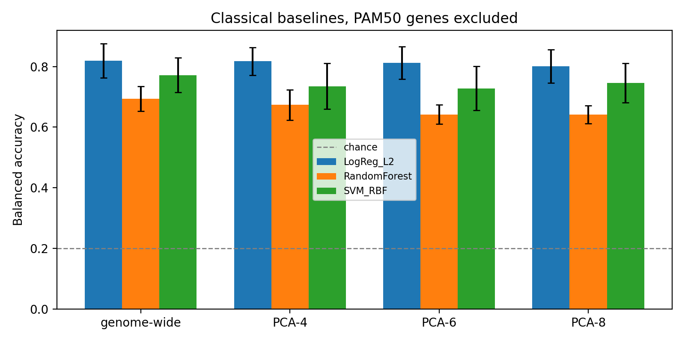
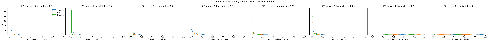
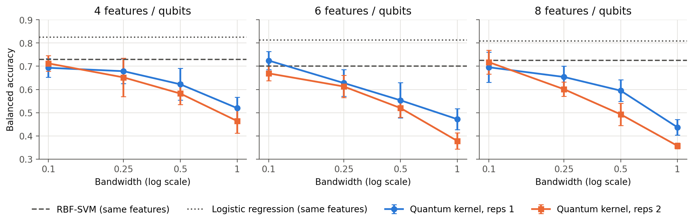
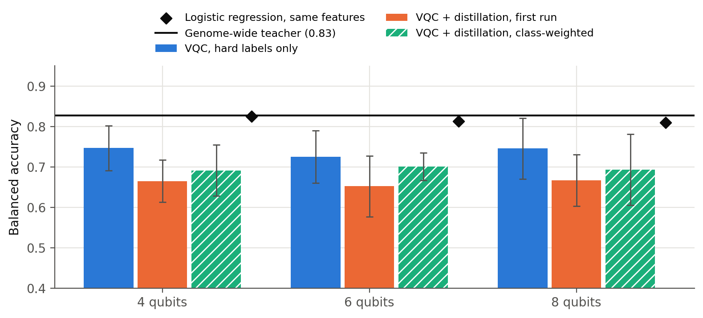

# Quantum kernels and distilled quantum classifiers for breast cancer subtyping

Md Shawmoon Azad

This project tests whether small quantum machine learning models can classify breast cancer molecular subtypes from gene expression, and how they compare with classical models given exactly the same inputs. It uses public TCGA breast cancer RNA-seq data and runs all quantum models in exact (noiseless) statevector simulation. It is a methods study on a precision oncology dataset, not a clinical tool.

## Summary of findings

Four principal components of genome-wide expression keep almost all of the subtype signal for a linear model. Logistic regression reaches 0.818 balanced accuracy on 4 components and 0.820 on all 20,480 genes, with the PAM50 genes removed.

A standard ZZ quantum kernel fails at its default input scaling because of kernel concentration: at 8 qubits almost every pair of patients looks equally dissimilar. Reducing the kernel bandwidth fixes this, and the quantum kernel then performs about as well as a classical RBF kernel on the same features (roughly 0.69 to 0.73 against 0.70 to 0.73). Neither kernel method reaches logistic regression.

A variational quantum classifier trained on the compressed features reaches 0.73 to 0.75. Knowledge distillation from a genome-wide classical teacher does not improve it, in either the original or a corrected version of the loss. The remaining gap to the teacher is not caused by information lost in compression, because logistic regression on the same features already gets close to the teacher. It comes from the quantum model's capacity or optimisation, which distillation does not address.

No result here suggests a quantum advantage.

## Data and task

The data are TCGA-BRCA gene-level RNA-seq (RSEM, log2(x + 1)) and PAM50 subtype calls, both from the UCSC Xena TCGA hub. After keeping one primary tumour per patient with a PAM50 label, 844 samples remain: Luminal A 421, Luminal B 192, Basal-like 141, HER2-enriched 67 and Normal-like 23. The task is five-class classification, scored mainly by balanced accuracy (chance is 0.20), with macro-F1 and macro one-vs-rest AUC as secondary metrics.

PAM50 subtypes are assigned from the expression of 50 specific genes. All 50 were removed before modelling, so the models cannot simply re-learn the rule that produced the labels.

## Methods

**Evaluation.** Week 1 uses repeated stratified 5-fold cross-validation (3 repeats). Weeks 2 and 3 use the first repeat (5 folds) because quantum simulation is slower. The same saved splits are used in every notebook. Every step that looks at the data (a filter keeping the 5,000 most variable genes, scaling, PCA, rescaling to [0, π] for circuit input, and all hyperparameter searches) is fitted inside each training fold only. As a leakage check, logistic regression trained on shuffled labels scored 0.19 ± 0.02, close to chance.

**Classical models.** L2-regularised logistic regression, an RBF-kernel SVM and a random forest, all with balanced class weights, trained on both the genome-wide genes and on 4, 6 and 8 PCA components.

**Quantum kernels.** A ZZ feature map (Havlíček et al., 2019) with linear entanglement and 1 or 2 repetitions, on 4, 6 and 8 qubits, one feature per qubit. The kernel is the state fidelity k(x, x') = |⟨φ(x)|φ(x')⟩|², computed exactly. Inputs are multiplied by a bandwidth b before encoding, with b in {1.0, 0.5, 0.25, 0.1}, and every value tested is reported. Each kernel is used in an SVM whose C is chosen by inner cross-validation on the training kernel. For each kernel I also record the spread of off-diagonal values (concentration) and the centred kernel-target alignment, both computed on training data only.

**Variational quantum classifier and distillation.** The circuit uses data re-uploading (Pérez-Salinas et al., 2020): three layers, each encoding the features with RY rotations and then applying trainable RY and RZ rotations and a CNOT chain. The Z expectation of each qubit feeds a linear layer with five outputs. The circuit is simulated with a small PyTorch statevector simulator, checked against Qiskit to within 4 × 10⁻⁷. The model is trained for 150 epochs with Adam in two ways that differ only in the target: hard labels with class-weighted cross-entropy (VQC-CE), and hard labels plus the teacher's soft labels (VQC-KD, Hinton et al., 2015) with temperature 2 and equal weight on the two loss terms. The teacher is genome-wide logistic regression. Its soft labels for training samples are cross-fitted (produced by an inner 5-fold cross-validation), so they are not overconfident and never use the student's test fold. Temperature and loss weight were fixed before any run and not tuned.

## Results

### 1. Compression costs almost nothing for a linear model

Balanced accuracy, mean ± standard deviation over 15 folds.

| Features | Logistic regression | RBF-SVM | Random forest |
|---|---|---|---|
| Genome-wide (20,480 genes) | 0.820 ± 0.056 | 0.772 ± 0.057 | 0.694 ± 0.041 |
| PCA, 4 components | 0.818 ± 0.046 | 0.735 ± 0.076 | 0.674 ± 0.050 |
| PCA, 6 components | 0.813 ± 0.054 | 0.728 ± 0.073 | 0.642 ± 0.032 |
| PCA, 8 components | 0.801 ± 0.055 | 0.746 ± 0.065 | 0.642 ± 0.030 |

Macro-F1 does drop with compression (0.824 genome-wide against 0.743 at 4 components for logistic regression), so some finer class information is lost, mainly for the smaller classes.



### 2. The quantum kernel concentrates, and bandwidth fixes it

At bandwidth 1.0 the off-diagonal kernel values collapse towards zero as qubits are added. At 8 qubits their mean is 0.006, so the kernel matrix is close to the identity and the SVM has little structure to learn from. Accuracy falls as qubits and repetitions increase.



Reducing the bandwidth improved the quantum kernel at every qubit count and depth. Kernel-target alignment, which uses training data only, rose in step (from 0.08 to 0.13 at bandwidth 1.0 to 0.24 to 0.28 at bandwidth 0.1), so it could have been used to choose the bandwidth without looking at test results.

Balanced accuracy, mean over 5 folds, same inputs for every model.

| Qubits | ZZ, reps 1, b = 1.0 | ZZ, reps 1, b = 0.1 | ZZ, reps 2, b = 0.1 | RBF-SVM | Logistic regression |
|---|---|---|---|---|---|
| 4 | 0.520 | 0.693 | 0.712 | 0.729 | 0.825 |
| 6 | 0.472 | 0.725 | 0.669 | 0.700 | 0.813 |
| 8 | 0.437 | 0.696 | 0.718 | 0.725 | 0.809 |

The differences between the best quantum kernel and the RBF-SVM are within one standard deviation. Performance was still rising at b = 0.1, the smallest value tested, so the best bandwidth was not found. At small bandwidth the rotation angles are small and the ZZ kernel behaves more like a smooth classical kernel, which is consistent with Shaydulin and Wild (2022) and Canatar et al. (2023). Part of the improvement therefore comes from moving the quantum kernel into a more classical regime.



### 3. Distillation does not help the variational classifier

Balanced accuracy, mean ± standard deviation over 5 folds. The teacher scores 0.827 ± 0.063 on these folds.

| Qubits | VQC-CE | VQC-KD, first run | VQC-KD, class-weighted | Folds where weighted KD beat CE |
|---|---|---|---|---|
| 4 | 0.746 ± 0.056 | 0.665 ± 0.052 | 0.691 ± 0.063 | 0 of 5 |
| 6 | 0.725 ± 0.064 | 0.652 ± 0.075 | 0.701 ± 0.034 | 2 of 5 |
| 8 | 0.745 ± 0.075 | 0.666 ± 0.064 | 0.693 ± 0.088 | 2 of 5 |

In the first run only the cross-entropy term was class-weighted, so the distillation term was dominated by the Luminal A majority and the comparison mixed two effects. I corrected this once, weighting the distillation term by class in the same way, before seeing new results. Both runs are reported. The correction narrowed the drop but did not remove it, and macro-F1 and AUC were essentially unchanged by distillation.

The VQC without distillation already does slightly better than both kernel methods on the same features. The likely reason distillation fails is that the student is not short of information: logistic regression on its 4 input features scores 0.825, close to the teacher. The gap between the VQC and the teacher comes from the circuit's capacity or from optimisation, and soft labels do not give a model a decision boundary it has trouble representing.



## Limitations

All quantum results come from noiseless simulation, so they say nothing about performance on hardware. Weeks 2 and 3 use a single cross-validation repeat of 5 folds, which is too few for strong statistical claims, and the Normal-like class has only about 4 test samples per fold, which makes balanced accuracy noisy. PCA was fixed and unsupervised, and the VQC architecture, learning rate and epochs were chosen once and not tuned. The teacher's cross-fitted soft labels were still confident (mean top probability 0.93), which limits how much extra information distillation can pass on. Finally, predicting PAM50 subtypes re-derives an existing classification from other genes. It shows what the models can learn from expression data, but it is not a clinical prediction such as survival or treatment response.

## Repository contents

```
week1_data_baselines_teacher.ipynb      data download, PAM50 gene removal, splits, classical models, teacher
week2_quantum_kernels.ipynb             ZZ quantum kernels, bandwidth sweep, concentration and alignment
week3_distillation.ipynb                variational classifier with and without distillation (first run)
week3_distillation_weightedKD.ipynb     same, with class-weighted distillation (revised run)
make_report_figures.py                  builds the two summary figures in figures/
outputs/                                result tables (CSV), splits and metadata (JSON), figures
figures/                                summary figures used in this README
requirements.txt
```

Raw TCGA data, the compressed feature files and the kernel matrices are not included because of their size. Week 1 downloads the data and regenerates everything else.

## How to reproduce

```bash
conda create -n qbio python=3.11 -y
conda activate qbio
pip install -r requirements.txt
```

Then run the notebooks in order (week 1, week 2, week 3, week 3 weighted), and finally `python make_report_figures.py`. Week 2 must be run with `BANDWIDTHS = [1.0, 0.5, 0.25, 0.1]` to reproduce the sweep. Everything runs on a laptop CPU. Week 1 takes the longest because of the genome-wide models.

## References

Canatar, A., Peters, E., Pehlevan, C., Wild, S. M., and Shaydulin, R. (2023). Bandwidth enables generalization in quantum kernel models. *Transactions on Machine Learning Research*.

Cortes, C., Mohri, M., and Rostamizadeh, A. (2012). Algorithms for learning kernels based on centered alignment. *Journal of Machine Learning Research*, 13, 795–828.

Goldman, M. J., et al. (2020). Visualizing and interpreting cancer genomics data via the Xena platform. *Nature Biotechnology*, 38, 675–678.

Havlíček, V., et al. (2019). Supervised learning with quantum-enhanced feature spaces. *Nature*, 567, 209–212.

Hinton, G., Vinyals, O., and Dean, J. (2015). Distilling the knowledge in a neural network. arXiv:1503.02531.

Parker, J. S., et al. (2009). Supervised risk predictor of breast cancer based on intrinsic subtypes. *Journal of Clinical Oncology*, 27(8), 1160–1167.

Pérez-Salinas, A., Cervera-Lierta, A., Gil-Fuster, E., and Latorre, J. I. (2020). Data re-uploading for a universal quantum classifier. *Quantum*, 4, 226.

Shaydulin, R., and Wild, S. M. (2022). Importance of kernel bandwidth in quantum machine learning. *Physical Review A*, 106, 042407.

The Cancer Genome Atlas Network (2012). Comprehensive molecular portraits of human breast tumours. *Nature*, 490, 61–70.

Thanasilp, S., Wang, S., Cerezo, M., and Holmes, Z. (2024). Exponential concentration in quantum kernel methods. *Nature Communications*, 15, 5200.

## Related work by the author

[Parameter-efficient quantum neural networks via knowledge distillation](https://github.com/shawmoonazad/Parameter-Efficient-Quantum-Neural-Networks-via-Knowledge-Distillation) and [Interpretable VQA](https://github.com/shawmoonazad/Interpretable-VQA).
